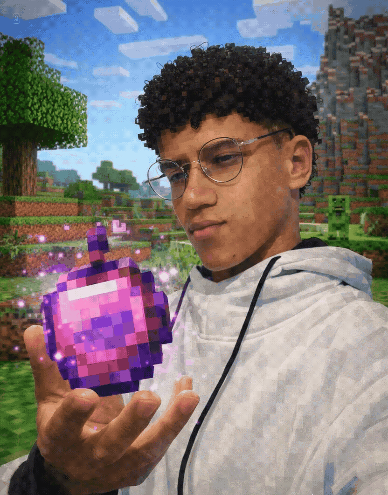

## 🧑‍💻 About Me

Atualmente, sou estudante de Sistemas de Informação na UFVJM (Universidade Federal dos Vales do Jequitinhonha e Mucuri). Proatividade, responsabilidade e comunicação em projetos são características notavéis, com o objetivo integrar uma equipe de tecnologia que me permita aprender continuamente, colaborar em soluções digitais e evoluir como desenvolvedor.

  

## 🔧 Skills:

| Área              | Habilidades                                                                                   |
|-------------------|-----------------------------------------------------------------------------------------------|
| **Idiomas**    | Português, Inglês                                                                           |
| **Office**   |Word, Excel, PowerPoint                                                                               |

## 🖥️ Stack:

  
  
  
  
  
  
  
  
  

<picture align="center">
  <source media="(prefers-color-scheme: light)" srcset="https://raw.githubusercontent.com/EduardoSilva44/EduardoSilva44/output/github-contribution-grid-snake-dark.svg">
  <source media="(prefers-color-scheme: light)" srcset="https://raw.githubusercontent.com/EduardoSilva44/EduardoSilva44/output/github-contribution-grid-snake-dark.svg">
  
</picture>
